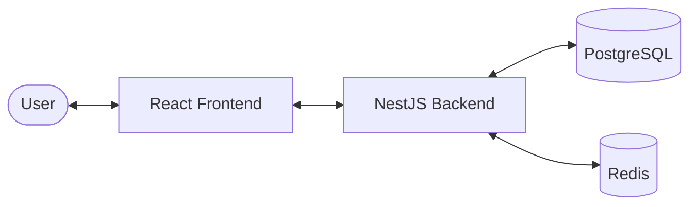

# System Design - UB Karaoke

## 1. Architecture Overview
UB Karaoke is a web-based platform for karaoke venue discovery and booking management. It follows a client-server architecture:

- **Frontend**: A modern, responsive Single Page Application (SPA) built with **React** and **Vite**. It uses **Vanilla CSS** for custom styling and **PrimeReact** for professional UI components (DataTables, Dialogs, Forms). It employs the **Context API** for state management.
- **Backend**: A robust RESTful API built with **NestJS**, following a modular architecture.
- **Database**: **PostgreSQL** for relational data storage, managed via **TypeORM**.
- **Caching**: **Redis** is used for caching and performance optimization.

## 2. Database Schema
The system uses the following core entities:

- **User**: Stores registered users, including customers, staff, and admins. Includes role-based access control (RBAC).
- **Venue**: Represents a karaoke establishment, including metadata like district, address, price range, and booking rules.
- **Room**: Individual karaoke rooms within a venue, each with specific capacities, rates, and features.
- **Booking**: Records of room reservations made by customers.
- **Review**: Customer-generated feedback and ratings for venues.

### Entity Relationships
- A **Venue** has many **Rooms**.
- A **Venue** has many **Reviews**.
- A **User** (Customer) can have many **Bookings**.
- A **Room** can have many **Bookings**.
- A **User** (Customer) can write many **Reviews**.

## 3. Core Modules & API Design
The backend is organized into functional modules:

| Module | Responsibility |
| :--- | :--- |
| **Auth** | Handles JWT-based authentication and authorization. |
| **Users** | User profile management and role assignments. |
| **Venues** | CRUD operations for venue details and management. |
| **Rooms** | Management of room availability and specifications. |
| **Bookings** | Core logic for creating, viewing, and cancelling reservations. |
| **Reviews** | Handling user feedback and calculating venue ratings. |

## 4. Security & Authentication
- **Authentication**: JWT (JSON Web Tokens) are used for secure session management.
- **Authorization**: Role-based access control (RBAC) ensures users can only access endpoints and features appropriate for their role (`admin`, `staff`, `customer`).
- **Data Protection**: Passwords are hashed using `bcrypt` before storage.

## 5. Deployment & DevOps
- **Containerization**: The system supports **Docker** for consistent development and deployment environments (`docker-compose.yml`).
- **Configuration**: Environment variables (`.env`) manage sensitive credentials and environment-specific settings.
