# System Design - UB Karaoke

## 1. Architecture Overview
UB Karaoke is a web-based platform for karaoke venue discovery and booking management. It follows a client-server architecture:

- **Frontend**: A modern, responsive Single Page Application (SPA) built with **React** and **Vite**. It uses **Vanilla CSS** for custom styling and **PrimeReact** for professional UI components (DataTables, Dialogs, Forms). It employs the **Context API** for state management.
- **Backend**: A robust RESTful API built with **NestJS**, following a modular architecture.
- **Database**: **PostgreSQL** for relational data storage, managed via **TypeORM**.
- **Caching**: **Redis** is used for caching and performance optimization.

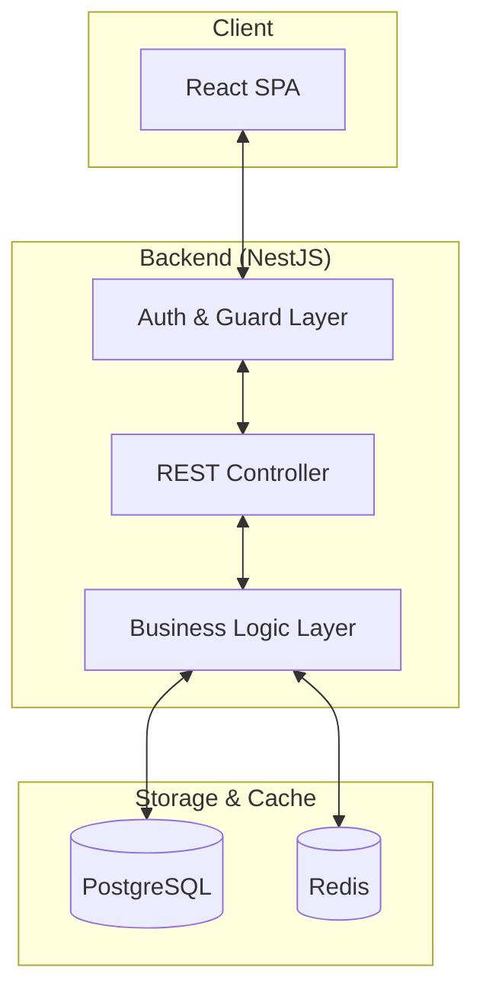

### Backend Module Structure
The API is split into domain-specific modules, each following the NestJS pattern of Controller-Service-Repository:
- **`AuthModule`**: Passport/JWT strategy for multi-role support.
- **`OrganizationsModule`**: Root of the business hierarchy.
- **`VenuesModule`**: Branches managed by organizations.
- **`RoomsModule`**: Booking units within venues, including pricing and availability logic.
- **`BookingsModule`**: Transactional flow, conflict detection, and status management.
- **`AccountsModule`**: Double-entry bookkeeping system (Assets, Liabilities, Revenue, Expenses).
- **`PaymentsModule`**: Payment processing (QPay, Cards), refunds, and transaction logging.
- **`PromotionsModule`**: Management of discount codes and validity.
- **`NotificationsModule`**: Handling email/SMS alerts for bookings and system events.
- **`PlansModule`**: Configuration of subscription tiers for organizations.
- **`AuditModule`**: Centralized logging for entity changes.

## 2. Database Schema
The system uses **UUIDs** for all primary keys to ensure scalability and security. The core entities include:

- **User**: Stores registered users, including customers, staff, and admins. Includes role-based access control (RBAC).
- **Organization**: Business entities that own and manage venues. Includes subscription plan tracking.
- **Venue**: Represents a karaoke establishment, including metadata like district, address, and operating hours.
- **Room**: Individual karaoke rooms with specific capacities, rates, types, and features.
- **Booking**: Records of room reservations with status history.
- **Account & LedgerEntry**: Financial records implementing double-entry accounting for auditability.
- **Payment & Transaction**: Records of monetary exchanges and gateway responses.
- **Promotion**: Discount codes with specific values and validity periods.
- **Review**: Customer-generated feedback and ratings.

### Common Metadata (Auditing & Status)
All major entities include standardized columns for tracking and status management:
- **`id` (UUID)**: Universally unique identifier.
- **`isActive` (Boolean)**: Replaces legacy `status` string for soft deactivation.
- **`createdBy` (UUID)**: ID of the user who created the record.
- **`updatedBy` (UUID)**: ID of the user who last modified the record.
- **`createdAt` (Timestamp)**: Automated record creation time.
- **`updatedAt` (Timestamp)**: Automated record last update time.

### Entity Relationships
- A **Venue** has many **Rooms**.
- A **Venue** has many **Reviews**.
- A **User** (Customer) can have many **Bookings**.
- A **Room** can have many **Bookings**.
- A **Booking** has many **Payments**.
- An **Organization** has many **Accounts** (Financial).

## 3. Core Modules & API Design
The backend is organized into functional modules:

| Module | Responsibility |
| :--- | :--- |
| **Auth** | Handles JWT-based authentication and authorization. |
| **Users** | User profile management and role assignments. |
| **Venues** | CRUD operations for venue details and management. |
| **Rooms** | Management of room specifications, **pricing**, and **availability**. |
| **Bookings** | Core booking flow, status transitions, and conflict checks. |
| **Accounts** | Financial ledger, balance tracking, and detailed transaction history. |
| **Payments** | Payment gateway integration, transaction recording, and refunds. |
| **Promotions** | Management of discount codes and validation logic. |
| **Reviews** | Handling user feedback and calculating venue ratings. |
| **Notifications** | System alerts and user communications. |

## 4. Security & Authentication
- **Authentication**: JWT (JSON Web Tokens) are used for secure session management. Supports both password-based and **OTP (One-Time Password)** flows.
- **Authorization**: Role-based access control (RBAC) ensures users can only access endpoints and features appropriate for their role (`sysadmin`, `admin`, `manager`, `staff`, `customer`).
- **Role-Based Login Paths**:
    - Administrative users (Sysadmin, Admin) log in through the `/admin` entry point.
    - Operational users (Manager, Staff) use the `/staff/login` entry point.
- **Data Protection**: Passwords are hashed using `bcrypt` before storage.

## 6. Logical Flows

### 6.1 Hierarchical Deactivation Flow
The system enforces hierarchy via the Service layer. When a parent entity is deactivated (`isActive: false`), child entities are implicitly filtered out from public lookups.

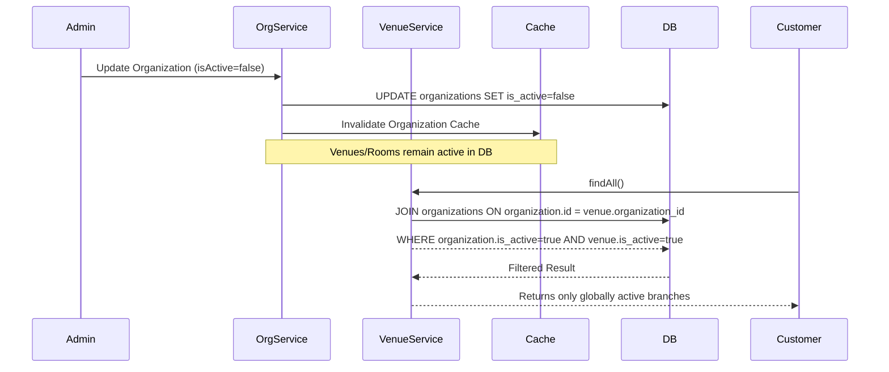

### 6.2 Booking Flow
The booking process involves real-time availability checks and role-based confirmation.

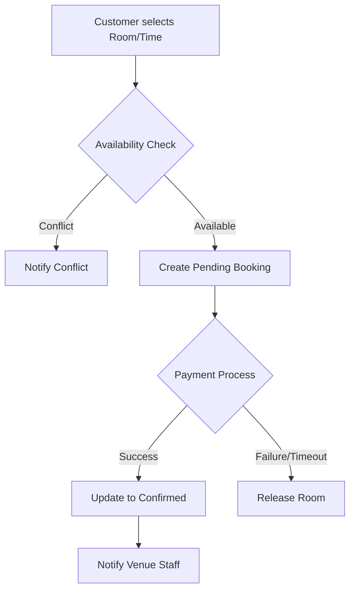

## 7. Deployment & DevOps
- **Containerization**: The system supports **Docker** for consistent development and deployment environments (`docker-compose.yml`).
- **Configuration**: Environment variables (`.env`) manage sensitive credentials and environment-specific settings.

---

# 8. Detailed System Architecture

This section provides comprehensive diagrams of the UB Karaoke App's data model and operational flows. All keys use **UUIDs**.

## 8.1. High-Level Conceptual ERD

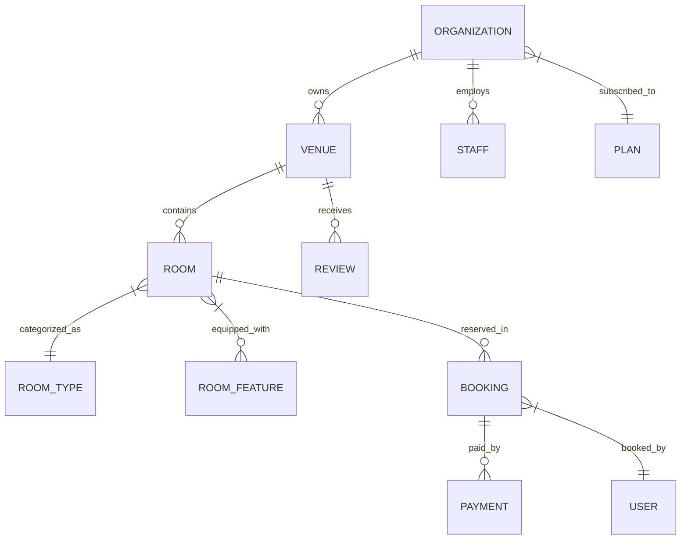

## 8.2. Exhaustive Technical ERD

Includes all entities, columns, data types, and relationships.

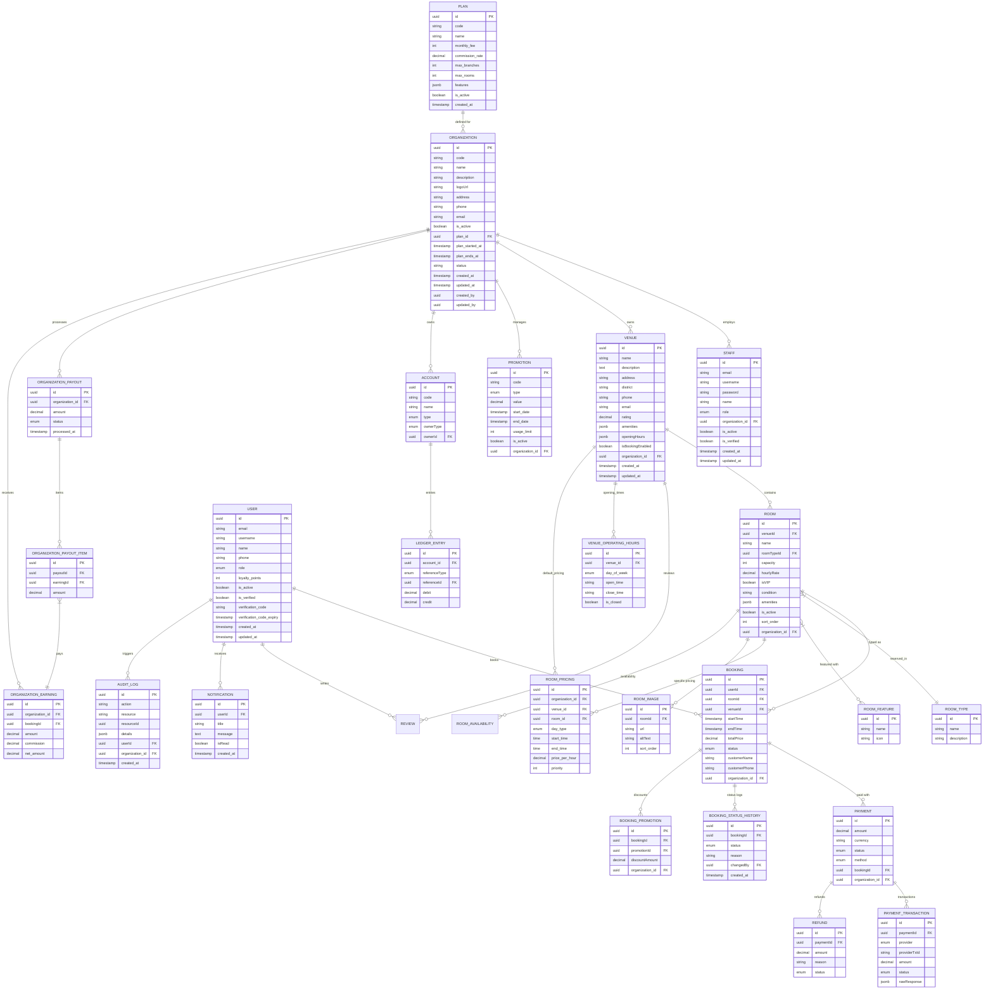

## 8.3. Class Diagram: Core Services Flow

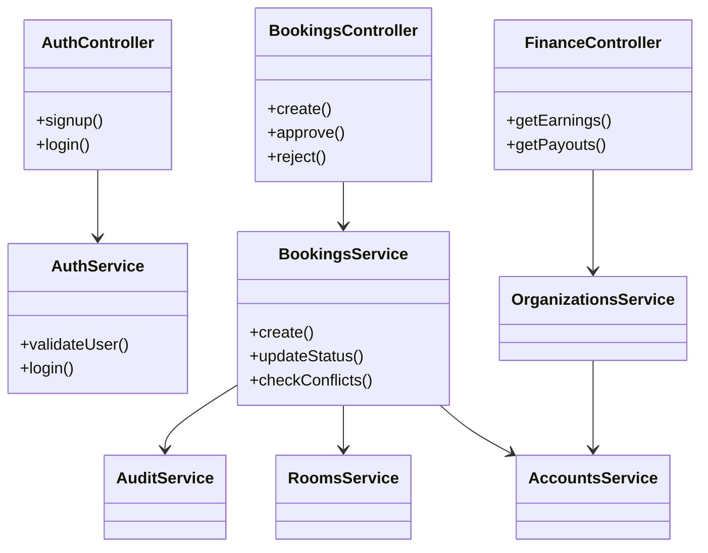

## 8.4. Operational Diagrams

### 8.4.1. Sequence Diagram: Online Booking Flow

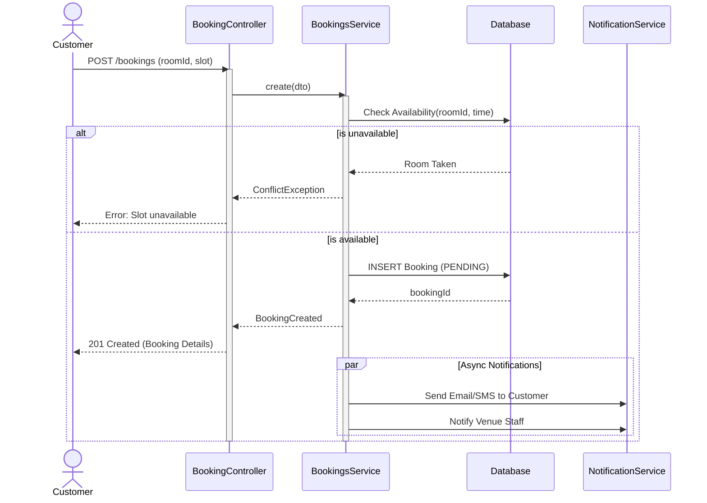

### 8.4.2. Activity Diagram: Booking Lifecycle

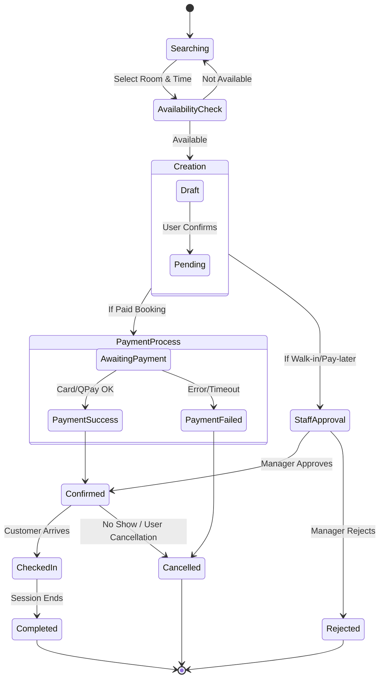

### 8.4.3. Entity State Diagram: Booking Status

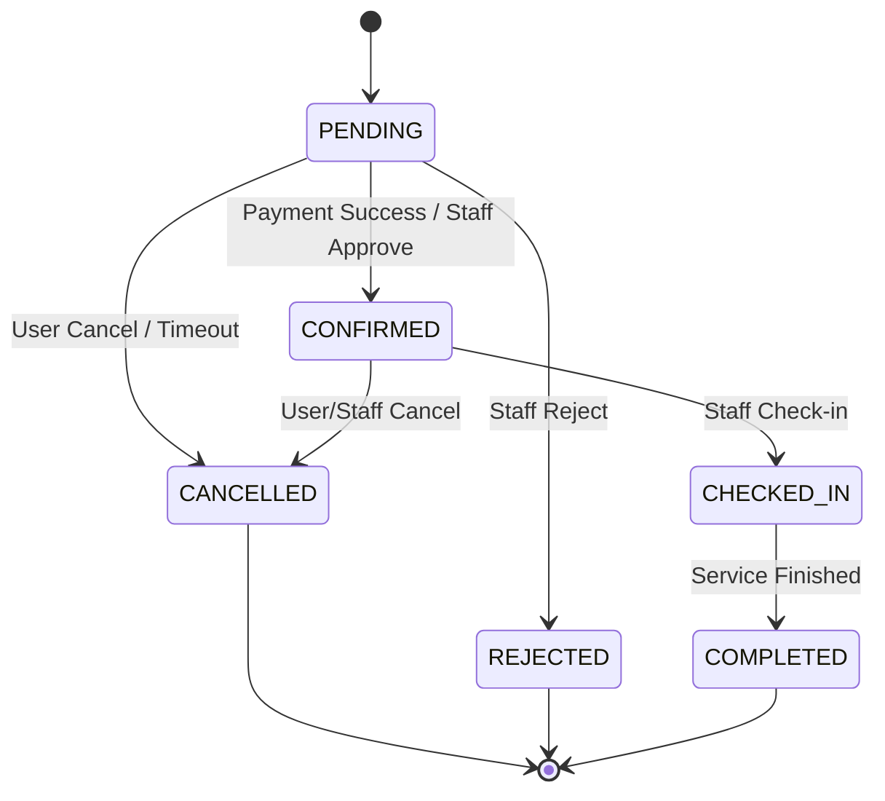

### 8.4.4. Use Case Diagram

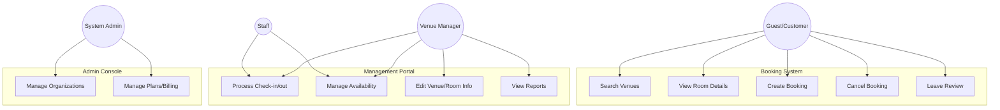

## 8.5. Loyalty Program Workflows

The loyalty system incentivizes repeat customers with a simple earn-and-burn mechanism.

**Rules:**
- **Earn**: 1 Point for every 10,000 MNT spent on COMPLETED bookings.
- **Redeem**: 1 Point = 100 MNT discount.
- **Limit**: Max 50% of total booking price can be paid with points.

### 8.5.1. Sequence Diagram: Point Redemption (Booking Creation)

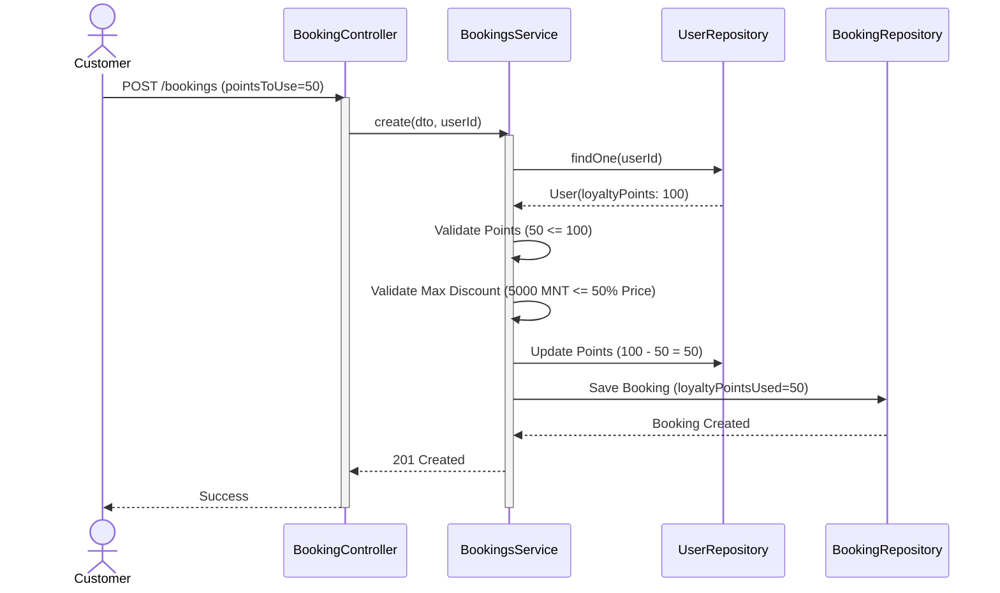

### 8.5.2. Sequence Diagram: Point Earning (Booking Completion)

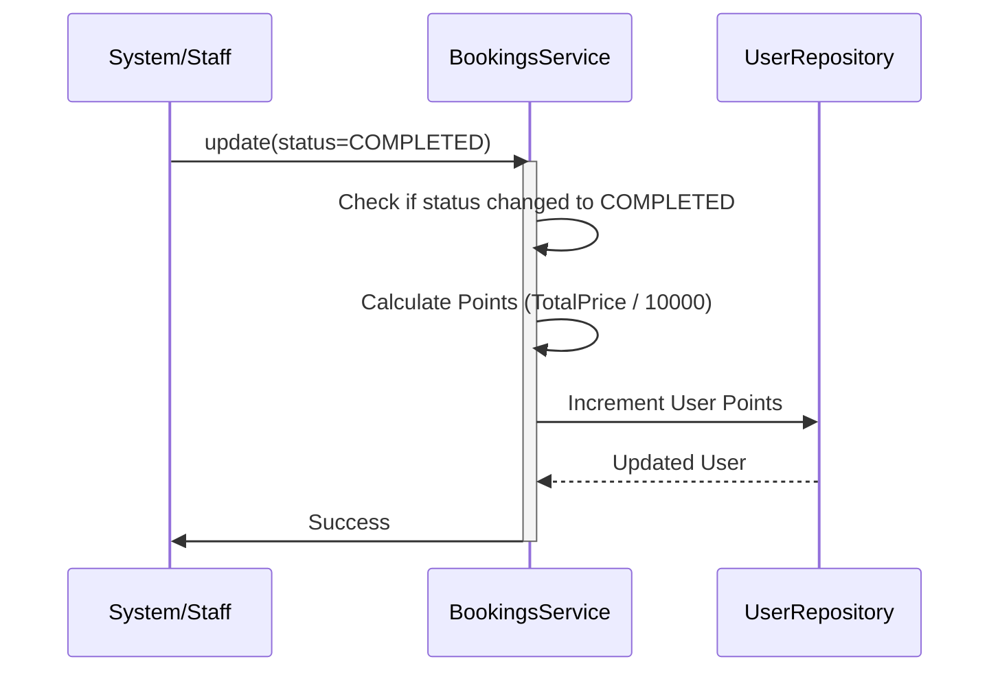

## 8.6. Mobile UX Design

The UB Karaoke App follows a **mobile-first** design philosophy, specifically optimized for the customer portal to ensure a premium, native-app-like experience.

### Key UX Features:
- **Sticky Navigation**: Context-aware headers and action bars that stay accessible during scroll.
- **Segmented Control Tabs**: Intuitive switching between active bookings, history, rewards, and settings.
- **Micro-Animations**: Use of CSS transitions and PrimeReact animations to enhance interactivity (e.g., hover scaling, smooth tab transitions).
- **Native Components**: Custom-styled UI elements using Vanilla CSS to achieve a high-end, dark-mode focused aesthetic.
- **Deferred Authentication**: Allowing users to browse and select rooms before requiring login, reducing friction in the booking funnel.
