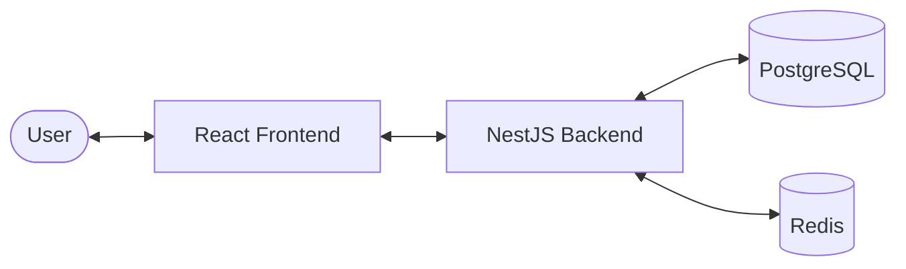

# System Design - UB Karaoke

## 1. Architecture Overview
UB Karaoke is a web-based platform for karaoke venue discovery and booking management. It follows a client-server architecture:

- **Frontend**: A modern, responsive Single Page Application (SPA) built with **React** and **Vite**. It uses **Vanilla CSS** for styling and **Context API** for state management.
- **Backend**: A robust RESTful API built with **NestJS**, following a modular architecture.
- **Database**: **PostgreSQL** for relational data storage, managed via **TypeORM**.
- **Caching**: **Redis** is used for caching and performance optimization.

## 2. Database Schema
The system uses the following core entities:

- **User**: Stores registered users, including customers, staff, and admins. Includes role-based access control (RBAC).
- **Venue**: Represents a karaoke establishment, including metadata like district, address, price range, and booking rules.
- **Room**: Individual karaoke rooms within a venue, each with specific capacities, rates, and features.
- **Booking**: Records of room reservations made by customers.
- **Review**: Customer-generated feedback and ratings for venues.

### Entity Relationships
- A **Venue** has many **Rooms**.
- A **Venue** has many **Reviews**.
- A **User** (Customer) can have many **Bookings**.
- A **Room** can have many **Bookings**.
- A **User** (Customer) can write many **Reviews**.

## 3. Core Modules & API Design
The backend is organized into functional modules:

| Module | Responsibility |
| :--- | :--- |
| **Auth** | Handles JWT-based authentication and authorization. |
| **Users** | User profile management and role assignments. |
| **Venues** | CRUD operations for venue details and management. |
| **Rooms** | Management of room availability and specifications. |
| **Bookings** | Core logic for creating, viewing, and cancelling reservations. |
| **Reviews** | Handling user feedback and calculating venue ratings. |

## 4. Security & Authentication
- **Authentication**: JWT (JSON Web Tokens) are used for secure session management.
- **Authorization**: Role-based access control (RBAC) ensures users can only access endpoints and features appropriate for their role (`admin`, `staff`, `customer`).
- **Data Protection**: Passwords are hashed using `bcrypt` before storage.

## 5. Deployment & DevOps
- **Containerization**: The system supports **Docker** for consistent development and deployment environments (`docker-compose.yml`).
- **Configuration**: Environment variables (`.env`) manage sensitive credentials and environment-specific settings.
# Requirement Documentation - UB Karaoke

## 1. Functional Requirements

### 1.1 User Authentication & Profile
- **Login/Register**: Users must be able to create accounts and log in securely.
- **Profile Management**: Users can update their profile information (name, phone, email).
- **Loyalty Program**: Customers earn points based on their bookings.

### 1.2 Venue Discovery
- **List Venues**: Display a list of available karaoke venues with key information (rating, price range).
- **Search & Filter**: Users can search for venues by name and filter by district, price range, or amenities.
- **Venue Details**: View comprehensive venue information, including photos, location (GPS), and opening hours.

### 1.3 Booking Management
- **Room Selection**: View available rooms in a specific venue with rates and capacity.
- **Real-time Booking**: Check room availability and make instant reservations.
- **Booking Rules**: Venues can configure booking windows (e.g., 16:00-22:00) and advance booking limits.
- **My Bookings**: Customers can view their booking history and upcoming reservations.

### 1.4 Admin & Staff Portals
- **Venue Management**: Admins can add, edit, or remove venues and configure their booking rules.
- **Room Management**: Staff/Admins can manage room details and features.
- **Booking Tracking**: Real-time tracking of bookings for staff to manage venue operations.

### 1.5 Reviews & Ratings
- **Submit Reviews**: Customers can rate and review venues after their visit.
- **View Feedback**: Reviews are displayed on venue pages to help other users.

## 2. Non-Functional Requirements

- **Performance**: The UI should be responsive, with fast loading times for venue listings and search results.
- **Usability**: The application must be fully responsive, providing a seamless experience on both desktop and mobile devices.
- **Scalability**: The backend architecture (NestJS + Redis) should support a growing number of users and venues.
- **Reliability**: Secure handling of bookings and user data is critical.

## 3. User Personas

| Persona | Description | Primary Goals |
| :--- | :--- | :--- |
| **Customer** | Casual or frequent karaoke lovers. | Quick discovery of venues, easy booking, and tracking loyalty points. |
| **Staff Member** | Front desk or venue managers. | Efficiently managing room check-ins and tracking bookings for their venue. |
| **System Admin** | Platform operators. | Oversight of all venues, user management, and system-wide configuration. |
