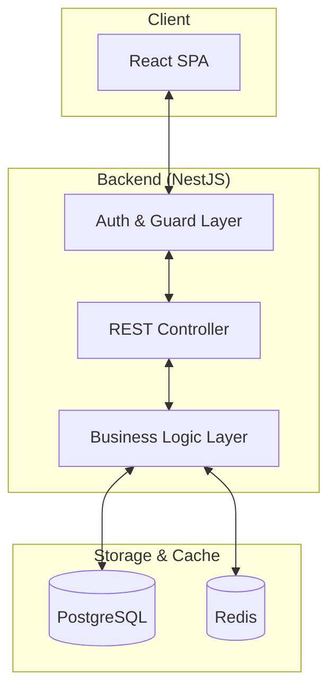
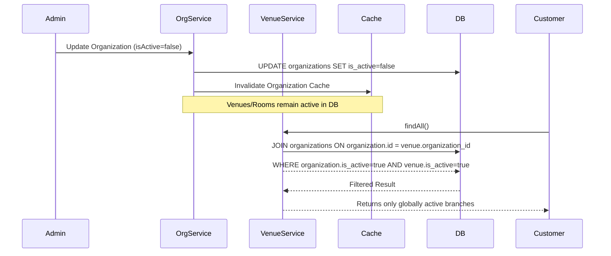

# System Design - UB Karaoke

## 1. Architecture Overview
UB Karaoke is a web-based platform for karaoke venue discovery and booking management. It follows a client-server architecture:

- **Frontend**: A modern, responsive Single Page Application (SPA) built with **React** and **Vite**. It uses **Vanilla CSS** for custom styling and **PrimeReact** for professional UI components (DataTables, Dialogs, Forms). It employs the **Context API** for state management.
- **Backend**: A robust RESTful API built with **NestJS**, following a modular architecture.
- **Database**: **PostgreSQL** for relational data storage, managed via **TypeORM**.
- **Caching**: **Redis** is used for caching and performance optimization.



### Backend Module Structure
The API is split into domain-specific modules, each following the NestJS pattern of Controller-Service-Repository:
- **`AuthModule`**: Passport/JWT strategy for multi-role support.
- **`OrganizationsModule`**: Root of the business hierarchy.
- **`VenuesModule`**: Branches managed by organizations.
- **`RoomsModule`**: Booking units within venues.
- **`BookingsModule`**: Transactional flow and availability.
- **`PromotionsModule`**: Management of discount codes and validity.
- **`PlansModule`**: Configuration of subscription tiers for organizations.
- **`AuditModule`**: Centralized logging for entity changes.

## 2. Database Schema
The system uses the following core entities:

- **User**: Stores registered users, including customers, staff, and admins. Includes role-based access control (RBAC).
- **Organization**: Business entities that own and manage venues. Includes subscription plan tracking (`planId`, `planStartedAt`, `planEndsAt`).
- **Venue**: Represents a karaoke establishment, including metadata like district, address, price range, and booking rules.
- **Room**: Individual karaoke rooms within a venue, each with specific capacities, rates, and features.
- **Booking**: Records of room reservations made by customers.
- **Promotion**: Discount codes with specific values (PERCENT/FIXED) and validity periods, linked to organizations or venues.
- **Review**: Customer-generated feedback and ratings for venues.
- **Verification**: Email/Phone number confirmation for users and staff.

### Common Metadata (Auditing & Status)
All major entities include standardized columns for tracking and status management:
- **`isActive` (Boolean)**: Replaces the legacy `status` string. Used for soft deactivation.
- **`isVerified` (Boolean)**: Tracks whether a user's contact information has been confirmed.
- **`createdBy` (Integer)**: ID of the user who created the record.
- **`updatedBy` (Integer)**: ID of the user who last modified the record.
- **`createdAt` (Timestamp)**: Automated record creation time.
- **`updatedAt` (Timestamp)**: Automated record last update time.

### Entity Relationships
- A **Venue** has many **Rooms**.
- A **Venue** has many **Reviews**.
- A **User** (Customer) can have many **Bookings**.
- A **Room** can have many **Bookings**.
- A **User** (Customer) can write many **Reviews**.

## 3. Core Modules & API Design
The backend is organized into functional modules:

| Module | Responsibility |
| :--- | :--- |
| **Auth** | Handles JWT-based authentication and authorization. |
| **Users** | User profile management and role assignments. |
| **Venues** | CRUD operations for venue details and management. |
| **Rooms** | Management of room availability and specifications. |
| **Bookings** | Core logic for creating, viewing, and cancelling reservations. |
| **Promotions** | Management of discount codes and validation logic. |
| **Reviews** | Handling user feedback and calculating venue ratings. |

## 4. Security & Authentication
- **Authentication**: JWT (JSON Web Tokens) are used for secure session management. Supports both password-based and **OTP (One-Time Password)** flows.
- **Authorization**: Role-based access control (RBAC) ensures users can only access endpoints and features appropriate for their role (`sysadmin`, `admin`, `manager`, `staff`, `customer`).
- **Role-Based Login Paths**:
    - Administrative users (Sysadmin, Admin) log in through the `/admin` entry point.
    - Operational users (Manager, Staff) use the `/staff/login` entry point.
- **Data Protection**: Passwords are hashed using `bcrypt` before storage.

## 6. Logical Flows

### 6.1 Hierarchical Deactivation Flow
The system enforces hierarchy via the Service layer. When a parent entity is deactivated (`isActive: false`), child entities are implicitly filtered out from public lookups.



### 6.2 Booking Flow
The booking process involves real-time availability checks and role-based confirmation.

```mermaid
mermaid
graph TD
    Start[Customer selects Room/Time] --> Check{Availability Check}
    Check -- Conflict --> Fail[Notify Conflict]
    Check -- Available --> Create[Create Pending Booking]
    Create --> Payment{Payment Process}
    Payment -- Success --> Confirm[Update to Confirmed]
    Payment -- Failure/Timeout --> Cancel[Release Room]
    Confirm --> Notify[Notify Venue Staff]
```

## 7. Deployment & DevOps
- **Containerization**: The system supports **Docker** for consistent development and deployment environments (`docker-compose.yml`).
- **Configuration**: Environment variables (`.env`) manage sensitive credentials and environment-specific settings.

# Requirement Documentation - UB Karaoke

## 1. Functional Requirements

### 1.1 User Authentication & Profile
- **Login/Register**: Users must be able to create accounts and log in securely. Supports **OTP (One-Time Password)** login via email/phone for customers. Features mandatory **Email/Phone Verification** for account activation.
- **Profile Management**: Users can update their profile information (name, phone, email).
- **Mobile-First Experience**: A premium, responsive profile section optimized for mobile devices, featuring sticky headers, segmented controls, and micro-animations.
- **Loyalty Program**: Customers earn points based on their bookings.
- **Deferred Login**: Customers can browse venues and rooms without logging in, only requiring authentication at the final booking step.

### 1.2 Venue Discovery
- **List Venues**: Display a list of available karaoke venues with key information (rating, price range).
- **Search & Filter**: Users can search for venues by name and filter by district, price range, or amenities.
- **Venue Details**: View comprehensive venue information, including photos, location (GPS), and opening hours.

### 1.3 Booking Management
- **Room Selection**: View available rooms in a specific venue with rates and capacity.
- **Real-time Booking**: Check room availability and make instant reservations.
- **Booking Rules**: Venues can configure booking windows (e.g., 16:00-22:00) and advance booking limits.
- **My Bookings**: Customers can view their booking history and upcoming reservations.

### 1.4 Admin & Staff Portals
- **Role-Based Login Separation**:
    - **System Admins & Admins**: Log in via `/admin`.
    - **Managers & Staff**: Log in via `/staff/login`.
- **Venue Management**: Admins can add, edit, or remove venues and configure their booking rules. Includes the ability to toggle venue visibility and booking availability.
- **Room Management**: Staff/Admins can manage room details, features, and pricing.
- **Organization Management**: System Admins can manage organizations, including manual overrides for **Subscription Plan Dates** (Start/End).
- **Promo Code Management**: Admins can create and manage promotional codes (percentage or fixed discounts) with validity periods.
- **Booking Tracking**: Real-time tracking of bookings for staff to manage venue operations.
- **Finance & Payouts**: Management of venue earnings and withdrawal/payout requests for organization owners.

### 1.5 Reviews & Ratings
- **Submit Reviews**: Customers can rate and review venues after their visit.
- **View Feedback**: Reviews are displayed on venue pages to help other users.

## 2. Non-Functional Requirements

- **Performance**: The UI should be responsive, with fast loading times for venue listings and search results.
- **Usability**: The application must be fully responsive and provide a consistent user experience across desktop and mobile devices. Modern UI components from **PrimeReact** are used to ensure high usability and accessibility.
- **Scalability**: The backend architecture (NestJS + Redis) should support a growing number of users and venues.
- **Reliability**: Secure handling of bookings and user data is critical.
- **Data Integrity & Auditing**: All system entities must maintain strictly standardized audit trails (`createdBy`, `updatedBy`) and use unified boolean flags (`isActive`) for status management to ensure data consistency and simplified hierarchical filtering.

## 3. User Personas

| Persona | Description | Primary Goals |
| :--- | :--- | :--- |
| **Customer** | Casual or frequent karaoke lovers. | Quick discovery of venues, easy booking, and tracking loyalty points. |
| **Staff Member** | Front desk or venue managers. | Efficiently managing room check-ins and tracking bookings for their venue. |
| **System Admin** | Platform operators. | Oversight of all venues, user management, and system-wide configuration. |
